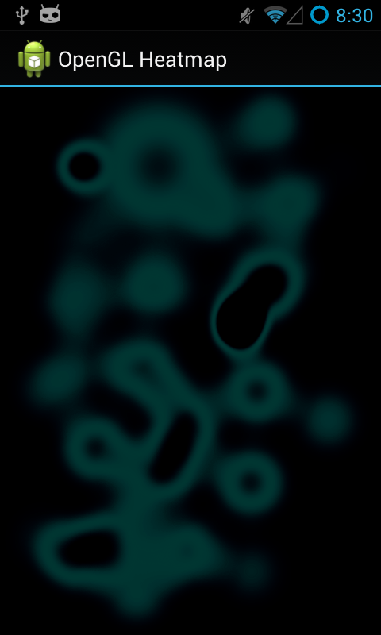

# Android OpenGL (ES 2.0) Heatmap

Android OpenGL ES 2.0 implementation of [webgl-heatmap.js](http://github.com/pyalot/webgl-heatmap) by [Florian Bösch](http://github.com/pyalot).

### Documentation

see [JavaDoc](http://xennis.github.io/android-opengl-heatmap/doc/)

### Screenshots



(Note: Colorization does not work yet.)

## Notes

### Tracer for OpenGL ES configuration

* Application package: `pyalot.heatmap.opengl`
* Activity to launch: `org.example.heatmap.OpenGLES20Activity`

### Progress

Java Code equivalent to JS code
* Framebuffer
* GLHeatmap (didn't set depth and antialias, glBlendFunc right?; quad_l as FloatBuffer?)
* Heights (Update glVertexAttribPointer)
* Main
* Node
* Shader
* Texture

GL code works

* getColor function works

WebGL Heatmap
=============

webgl-heatmap.js is a JavaScript library for high performance heatmap display.

Demo
----

Live Demo at [codeflow.org](http://codeflow.org/entries/2013/feb/04/high-performance-js-heatmaps "")  

How to use it
-------------

Instantiate a new heatmap, errors can be one of:

 * Webgl is not supported
 * No floating point texture support
 * Floating point render target not supported
 * Shader Compile Error: ...
 * Shader Link Error: ...

```javascript
try{
    var heatmap = createWebGLHeatmap({canvas: yourCanvas});
}
catch(error){
    // handle the error
}
```

creation arguments

 * canvas: the canvas you wish to draw on
 * width: explicit width
 * height: explicit height
 * intensityToAlpha: defaults to true
 * gradientTexture: texture used instead of color calculation, can be path or an image

Add a data point.

 * x and y relative to the canvas in pixels
 * size in pixels (radius)
 * intensity between 0 and 1

```javascript
heatmap.addPoint(x, y, size, intensity);
```

Add a list of data points.

 * x and y relative to the canvas in pixels
 * size in pixels (radius)
 * intensity between 0 and 1

```javascript
heatmap.addPoints([{x:x, y:y, size:size, intensity:intensity}]);
```

Draw queued data points:

```javascript
heatmap.update()
```

Display the heatmap

```javascript
heatmap.display()
```

Multiply all values in the heatmap by a number (useful for decay)

```javascript
heatmap.multiply(0.995)
```

Clamp all values in the heatmap to between two values:

```javascript
heatmap.clamp(0.0, 1.0)
```

Blur all values a little:

```javascript
heatmap.blur()
```

License
-------

Copyright (c) 2013, Florian Boesch <pyalot@gmail.com> http://codeflow.org/

WebGL Heatmap is licensed under any of the following licenses at your choosing:

 * MIT: see mit-license
 * GPL: see gplv*-license
 * BSD: see bsd-license
